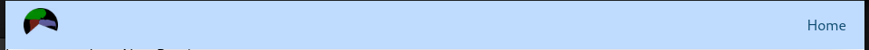

<!--
Get your module up and running quickly.

Find and replace all on all files (CMD+SHIFT+F):
- Name: My Module
- Package name: my-module
- Description: My new Nuxt module
-->

<h1 align="center">Nuxt - Scenic - Library</h1>
<p align="center">

</p>
<p align="center">


</p>

A simple library that contains customisable components to be used with the NuxtJS framework.
## Features

<!-- Highlight some of the features your module provide here -->
- Main Header is a responsive header that can adjust to the size of the user's screen.

## Quick Setup

Install the module to your Nuxt application with one command:

```bash
npm install nuxt-scenic-library # or use your favourite package manager
```

Next add the module to your nuxt.config.ts/js file:

```typescript
export default defineNuxtConfig({
  compatibilityDate: '2024-04-03',
  devtools: { enabled: true },
  modules: ['nuxt-scenic-library']
})
```

## Usage

### Reactive Header

TO use the reactive header, in a Vue component/page add the following:

```typescript
    <s-MainHeader
      site-logo="/logo.webp" // Or use site-name if no logo.
      font-color="text-sky-900"
      :page-links="[{linkName: 'Home', linkAddress: '/' }]"
    />
```
This will display the following header:



font-color needs to be in either the Tailwind text format: text-blue-400, or the hexadecimal value.

site-logo needs to be stored in the Public folder as the component uses NuxtImg to handle images.

background-color needs to be in either Tailwing bg format:
bg-blue-200
Or a hexadecimal format.


## Contribution

